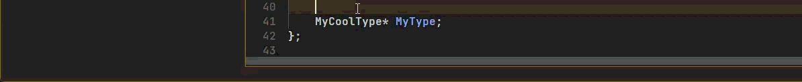

# Unreal Engine MACRO Snippets
This script allows you to insert a UPROPERTY, UFUNCTION, UCLASS, UINTERFACE, UDELEGATE, and USTRUCT at the cursor position, inserting a default MACRO that you can define in the 10x settings file.

The script also allows you to insert MACRO declarations that include a replacement parameter ( e.g. "$1") that can be used to "code complete"
valid MACRO values by case sensitive completion, or via up and down arrows.

## Usage

### Default Macros
If all you are looking to do is insert one of the MACROS with parameter values that you can manually change at a later time, create an entry in the 10x KeyBindings file ( e.g., for UPROPERTY I use `Control Shift U`) with a value of `InsertDefault<one of: UPROPERTY|UFUNCTION|UCLASS|UINTERFACE|UDELEGATE|USTRUCT>()`. 

For example:

`Control Shift U:       InsertDefaultUPROPERTY()`

You can specifiy the value to use when inserting the default value by creating a new setting value (`UE.Default_UPROPERTY`) in the 10x Settings file. 

Here is an example entry:

`UE.Default_UPROPERTY:              UPROPERTY(EditDefaultsOnly, BlueprintReadOnly, Category = "")`

If you do not add that setting, a default property will be inserted.

### Unreal Engine MACRO Parameter Completion
You can also insert a MACRO value that allows you to change the first and/or second parameter via code completion. To do this, bind the `Insert<macro name>_OneParm` and / or `Insert<macro name>_TwoParm` scripts to the appropriate key maps.

The `Insert<macro name>_OneParm` script will insert ( by default ) a value into your source file that looks like this:
`UPROPERTY($1, BlueprintReadOnly, Category = "")`. Notice the `$1` in the value. The `$1` will be selected, allowing you to type to find case-sensitive MACRO values. You can also use the Up and Down arrow keys to swap through valid values.

Once you find the value you are happy with, be sure to hit the ESCape key to exit UE Snippet completion mode. You will notice 10x status bar will indicate the state of completion.

The `Insert<MACRO name>_TwoParm` is the same as the `Insert<MACRO name>_OneParm`, but adds another replaceable parm. So by default, upon execution of the `Insert<MACRO name>_TwoParm` script, you see ( by default ) the following:

`UPROPERTY($1, $2, Category = "")`

This will allow you to code complete values in the first parameter, and then hit the TAB key to find values in the second parameter. Again, hit ESC to exit completion mode.

NOTE: UPROPERTY is the only macro that currently has $2 support. All the rest just have $1.

**Example Key Bindings:**

`Control Shift U, 2:     InsertUPROPERTY_TwoParm()`

`Control Shift U, 1:     InsertUPROPERTY_OneParm()`

`Control Shift U:        InsertDefaultUPROPERTY()`

## Settings Values
You do not need to add any new 10x settings to make use of this script. However, if you want to provide your own defaults, the following settings can be used:

| Setting | Description |
| ------- | ----------- |
| UE.Default_UPROPERTY | Add the appropriate UPROPERTY syntax that you want to insert without going into completion mode |
| UE.OneParm_UPROPERTY | Add a UPROPERTY value that include the `$1` for whatever parameter you want to be able to use code completion for |
| UE.TwoParm_UPROPERTY | Add a UPROPERTY value that includes the `$1` and `$2` values that can be tabbed through for completion values |
| UE.Default_UFUNCTION | Add the appropriate UFUNCTION syntax that you want to insert without going into completion mode |
| UE.OneParm_UFUNCTION | Add a UFUNCTION value that include the `$1` for whatever parameter you want to be able to use code completion for |
| UE.Default_UCLASS | Add the appropriate UCLASS syntax that you want to insert without going into completion mode |
| UE.OneParm_UCLASS | Add a UCLASS value that include the `$1` for whatever parameter you want to be able to use code completion for |
| UE.Default_UINTERFACE | Add the appropriate UINTERFACE syntax that you want to insert without going into completion mode |
| UE.OneParm_UINTERFACE | Add a UINTERFACE value that include the `$1` for whatever parameter you want to be able to use code completion for |
| UE.Default_UDELEGATE | Add the appropriate UDELEGATE syntax that you want to insert without going into completion mode |
| UE.OneParm_UDELEGATE | Add a UDELEGATE value that include the `$1` for whatever parameter you want to be able to use code completion for |
| UE.Default_USTRUCT | Add the appropriate USTRUCT syntax that you want to insert without going into completion mode |
| UE.OneParm_USTRUCT | Add a USTRUCT value that include the `$1` for whatever parameter you want to be able to use code completion for |

**Example settings values:**

`UE.Default_UPROPERTY:   UPROPERTY(EditDefaultsOnly, BlueprintReadOnly, Category = "")`

`UE.OneParm_UPROPERTY:   UPROPERTY($1, BlueprintReadOnly, Category = "")`

`UE.TwoParm_UPROPERTY:   UPROPERTY($1, $2, Category = "")`
